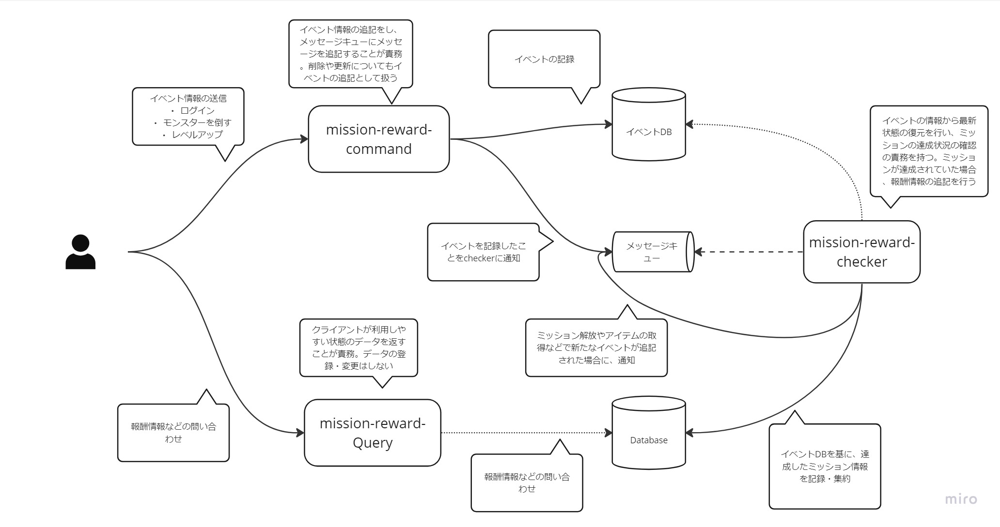
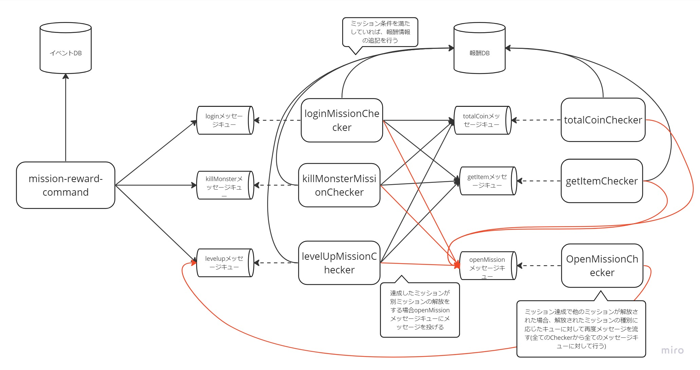

# mission-reward

## システム要件

<details>
<summary>システム要件</summary>

### ミッション機能の作成

モンスター育成・バトル系のゲームのミッション機能を作成してください。ミッションとは特定の条件を達成すると報酬が受け取れる仕組みのことです。
そのミッション機能を持つサービスをミッションサービスと呼ぶことにします。

#### **ミッション達成までの流れ**

- ミッションサービスにイベントを送る
- イベントから対象のミッションを探す
- 対象のミッションの達成条件を計算し、ミッションのステータスを更新する
- そのステータスが達成条件を満たしていたら達成状態に変化させ、報酬を配る

#### 要件定義

**ミッション一覧**

1. 特定のモンスターを倒す：１００コイン
2. ２０００コイン貯まる：アイテム A を付与
3. モンスター A のレベルが５になる：１００コイン
4. レベル５以上のモンスターが２体：１００コイン
   1. このミッションを達成した場合７を解放する
5. 任意のモンスターを 10 回倒す（毎週月曜日の午前 0 時にリセットされる）：１００コイン
6. ログイン（毎日午前 4 時にリセットされる）：１００コイン
7. アイテム A を所有する：１００コイン

注意点としては、ミッションをクリアすると解放されるミッションがある、同時に進行するミッションがある、毎日、毎週などの期間付きのミッションがあるところです。

### テーブル設計(例)

マスターミッションテーブル：ミッションのマスター情報を格納

ユーザーテーブル：ログイン日、保有コイン数などの情報を格納

モンスターテーブル：所有しているモンスター情報を格納

アイテムテーブル：所有しているアイテム情報を格納

ユーザーのミッション達成状況テーブル：ユーザーのミッション達成状況の情報を格納

これ以外に必要なテーブルがありましたら自由に拡張などをしてもらって構わないです。

### 送られるイベントとストーリー

#### 現在のユーザーの状態

1. 所有コインは 1800
2. 所有モンスターはモンスター A：４ Lv、モンスター B：７ Lv
3. アイテム未所有
4. 今週倒したモンスターは８体
5. ログイン日金曜１０時

#### ストーリー

以下のイベントのリクエストによってユーザーのミッション達成状態を更新してください。1~3 までの数字はそれぞれ１エンドポイントをさしています

**土曜の午後１０時**

1. ログインする
2. モンスター A が任意のモンスターを倒す
3. モンスター A のレベルが２上がる

**日曜の午後１０時**

1. ログインする
2. モンスター B が特定のモンスターを倒す
3. モンスター B がレベル１上がる

</details>

## アーキテクチャイメージ

<details>
<summary>アーキテクチャイメージ</summary>

### 全体



### キューとミッションチェッカー部分の詳細



### 実装したミッションのアーキテクチャで拡張を考慮する上で工夫した点

1. CQRS にすることで、責務を整理しやすくしました
2. イベントの記録と、その後のドメインロジックをキューで分離することで、イベントの記録は失敗しにくくしました
3. イベントの記録と、その後のドメインロジックをキューで分離することで、関心事の分離を行い、扱いやすくしました
4. イベントの記録と、その後のドメインロジックをキューで分離することで、イベントの記録のリクエストに対して response を素早く返すようにしました
5. 大きくに３つにわけることで、パフォーマンス状況次第で、それぞれを個別にスペック変更しやすくしました
6. Event Sourcing パターンを採用し、データの追記の形をとることで、障害やロジックの間違えが発生したとしても、データの復元、復旧がしやすい形にしました
7. 今後新しいミッションの形を追記する際に既存のミッションに影響をあたえにくいようにしました
8. DI の形をとることで、Test などで mock しやすいようにしました
9. ミッション解放というイベントの形をとり、キューにメッセージをいれることで、同じように扱えるようにしました
10. ミッション達成によるアイテムの取得や、コインの取得が発生した際にも、キューにメッセージをいれることで、透過的に扱えるようにしました
11. ミッションのリセットタイミングの指定方法を cron 表記の形をとることで、毎月や毎日、期間限定など様々なイベントに対応できるようにしました

</details>

## 動かすのに必要な環境

Go 1.20
Docker 24.0.2

## 動作確認手順

### 初期セットアップ方法

```
make tools
docker compose up -d db
make migrate-up
```

### 検証方法

#### サーバーの起動

1. サーバーの起動をします

```
make deps
docker-compose up -d
```

#### クライアントの起動

1. 別セッションを、立ち上げてクライアントの起動をします

```
make run-client
```

#### テストの実行

```
make test
```

## 残課題

<details>
<summary>残課題</summary>

- モンスターを倒すミッションの実装
- レベルアップミッションの実装
- アイテム取得ミッションの実装
- 冪等になるように upsert を使うようにする
- テストの追加
- チャンネルを適切に閉じる graceful shutdown
- 適切なエラーハンドリング

</details>
