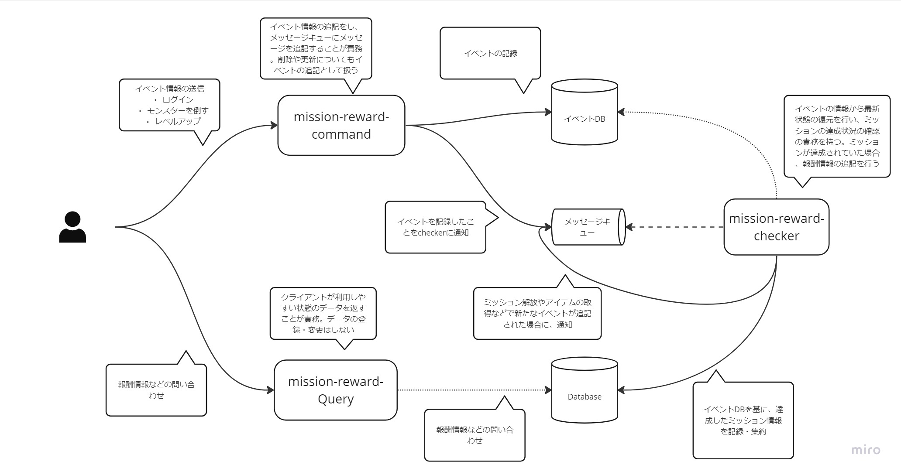

## アーキテクチャイメージ

### 全体

### キューとミッションチェッカー部分の詳細

## 実装したミッションのアーキテクチャで拡張を考慮する上で工夫した点
1. CQRSにすることで、責務を整理しやすくしました
2. イベントの記録と、その後のドメインロジックをキューで分離することで、イベントの記録は失敗しにくくしました
3. イベントの記録と、その後のドメインロジックをキューで分離することで、関心事の分離を行い、扱いやすくしました
4. イベントの記録と、その後のドメインロジックをキューで分離することで、イベントの記録のリクエストに対してresponseを素早く返すようにしました
5. 大きくに３つにわけることで、パフォーマンス状況次第で、それぞれを個別にスペック変更しやすくしました
6. Event Sourcing パターンを採用し、データの追記の形をとることで、障害やロジックの間違えが発生したとしても、データの復元、復旧がしやすい形にしました
7. 今後新しいミッションの形を追記する際に既存のミッションに影響をあたえにくいようにしました
8. DIの形をとることで、Testなどでmockしやすいようにしました
9. ミッション解放というイベントの形をとり、キューにメッセージをいれることで、同じように扱えるようにしました
10. ミッション達成によるアイテムの取得や、コインの取得が発生した際にも、キューにメッセージをいれることで、透過的に扱えるようにしました
11. ミッションのリセットタイミングの指定方法をcron表記の形をとることで、毎月や毎日、期間限定など様々なイベントに対応できるようにしました
